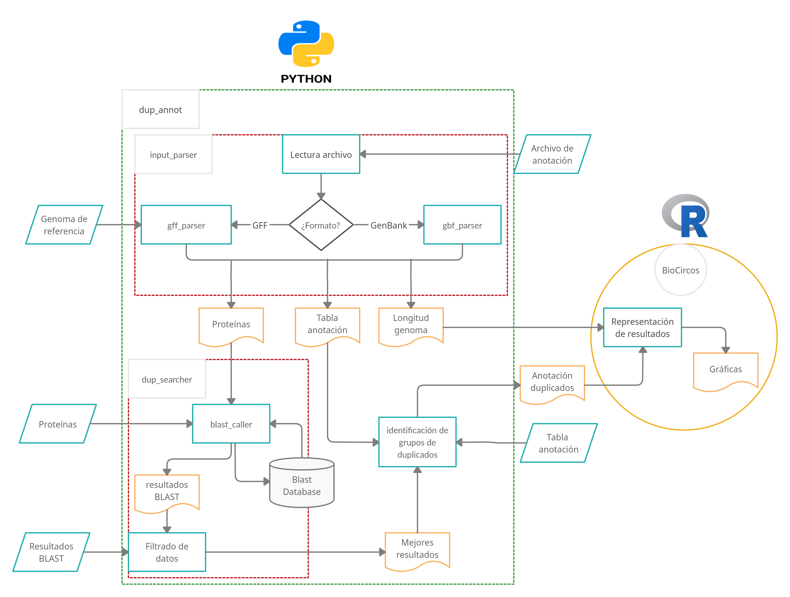

# Bacterial Duplicates pipeline 

# Table of Contents

- [Introduction](#introduction)
- [Documentation](#documentation)
- [Workflow](#workflow)
- [License](#license)

# Introduction

This is a pipeline for the identification and analysis of duplicate genes in bacteria.

The development of this research originally started at:

1. As a collaboration within the Genetics, Microbiology and Statistics department at University Barcelona, School of Biology (Github repository: https://github.com/molevol-ub/BacterialDuplicates) which lead to:

- **Duplicates in *Escherichia coli* genomes**: 

	Gene duplications in the E. coli genome: common themes among pathotypes. Bernabeu M., Sánchez-Herrero JF., Huedo P., Prieto A., Hüttener M., Rozas J. and Juárez A. **BMC Genomics** *2019 20:313*, https://doi.org/10.1186/s12864-019-5683-4. Check [source code](https://github.com/molevol-ub/BacterialDuplicates/releases/tag/v1.0) and additional details and parameters [here](https://github.com/molevol-ub/BacterialDuplicates/blob/master/Ecoli/README.md).

- **Duplicates in Gram positive cocci**:

	Gene Duplications in the Genomes of Staphylococci and Enterococci. Sanchez-Herrero JF., Bernabeu M., Prieto A., Hüttener M. and Juárez A. **Front. Mol. Biosci.** *2020 7:160*. https://doi.org/10.3389/fmolb.2020.00160. Check [source code](https://github.com/molevol-ub/BacterialDuplicates/releases/tag/v2.0) and details and parameters [here](https://github.com/molevol-ub/BacterialDuplicates/blob/master/Gram_positive/README.md).

	  
  
  
2. Alba Moya (@albamgarces) Master thesis project: https://github.com/albamgarces/TFM_UOC_AMoya

# Workflow

So far, the pipeline is under development. The workflow is shown here:

# License

MIT License

Copyright (c) 2021 JF Sanchez-Herrero and Alba Moya

Permission is hereby granted, free of charge, to any person obtaining a copy
of this software and associated documentation files (the "Software"), to deal
in the Software without restriction, including without limitation the rights
to use, copy, modify, merge, publish, distribute, sublicense, and/or sell
copies of the Software, and to permit persons to whom the Software is
furnished to do so, subject to the following conditions:

The above copyright notice and this permission notice shall be included in all
copies or substantial portions of the Software.

THE SOFTWARE IS PROVIDED "AS IS", WITHOUT WARRANTY OF ANY KIND, EXPRESS OR
IMPLIED, INCLUDING BUT NOT LIMITED TO THE WARRANTIES OF MERCHANTABILITY,
FITNESS FOR A PARTICULAR PURPOSE AND NONINFRINGEMENT. IN NO EVENT SHALL THE
AUTHORS OR COPYRIGHT HOLDERS BE LIABLE FOR ANY CLAIM, DAMAGES OR OTHER
LIABILITY, WHETHER IN AN ACTION OF CONTRACT, TORT OR OTHERWISE, ARISING FROM,
OUT OF OR IN CONNECTION WITH THE SOFTWARE OR THE USE OR OTHER DEALINGS IN THE
SOFTWARE.

