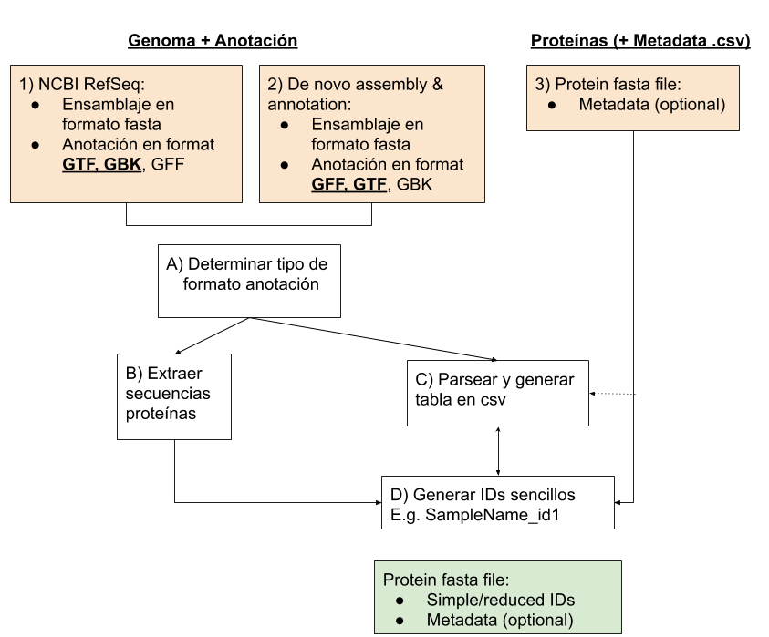

# Entrada de datos e información

En nuestro proyecto la información puede provenir de diferentes sitios y tener diferente formato:
1) Que nosotros descarguemos esa información (Para hacer más adelante) directamente de NCBI de la base de datos RefSeq o GenBank (repositorio ftp). Ver ejemplo en la carpeta [example_NCBI](../../data/example_NCBI)
2) Que el usuario nos aporte un ensamblaje de novo y una anotación de novo. Ver ejemplo en la carpeta [example_denovo](../../data/example_denovo)
3) Que el usuario nos de una serie de proteínas de interés. Ver ejemplo en la carpeta [example_protein](../../data/example_protein)

Por tanto, dependiendo del tipo de información, el tratamiento de esta será diferente y necesitaremos realizar una serie de funciones. Hay algunos puntos en comun y el resultado final es el mismo, por ello, vamos a intentar unificar todo el proceso.

Ver detalle en la siguiente figura:

Ya sea proveniente de la anotación del usuario de novo o de genbank, podemos llegar a tener hasta 3 tipos de formatos que incluyan la anotación del genoma: GTF, GFF3 y GenBank. Veamos los diferentes tipos de formatos:

- **GenBank** (.gbk/.gb): 
    GenBank format is intended to be human readable, and is a widely used file format for annotated genomes. 

    Example https://www.ncbi.nlm.nih.gov/Sitemap/samplerecord.html

- **GTF/GFF2**

    "General Feature Format version 2" o "General Transfer Format": consists of one line per feature, each containing 9 columns of data, plus optional track definition lines. See specifications [here] (http://gmod.org/wiki/GFF2)

    Example https://www.ensembl.org/info/website/upload/gff.html

- **GFF3**

    "General Feature Format version 3". GFF3 addresses several shortcomings in its predecessor, GFF2. See [details](http://gmod.org/wiki/GFF3)

    Example https://www.ensembl.org/info/website/upload/gff3.html

Será necesario generar funciones que hagan diferentes partes del proceso.

A) Determinar que tipo de formato de anotation. 

Por tanto, sería conveniente y necesario determinar que tipo de formato tenemos para extraer la información de una forma u otra. Tanto GTF como GFF son formatos tabulares mientras GBF es un poco mas elavorado. 

Para GBF existe un parseador específico de BioPython que se denominad SeqIO que ya incluye GBK (https://biopython.org/wiki/SeqIO). 
E.g.
    
    seq_record = SeqIO.parse(open(genbank_path), "genbank").next()

Para GFF tambien existe algo ya implementado (https://biopython.org/wiki/GFF_Parsing).

